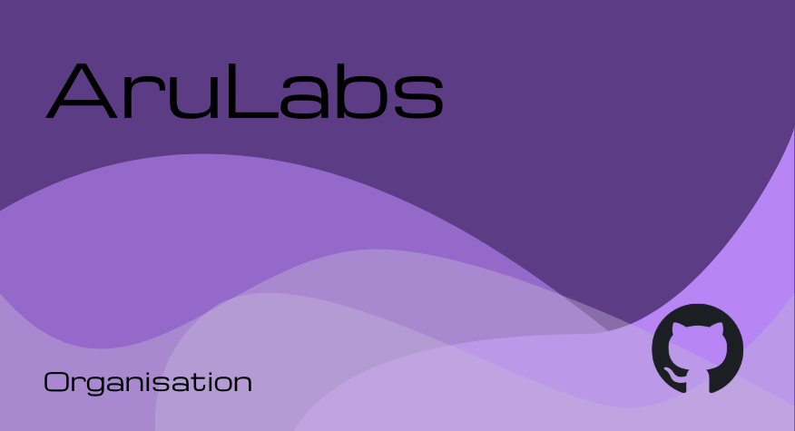
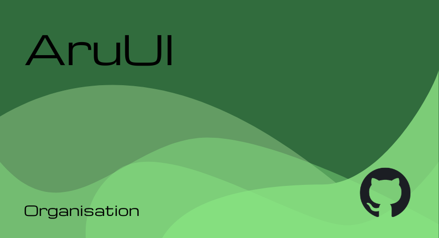
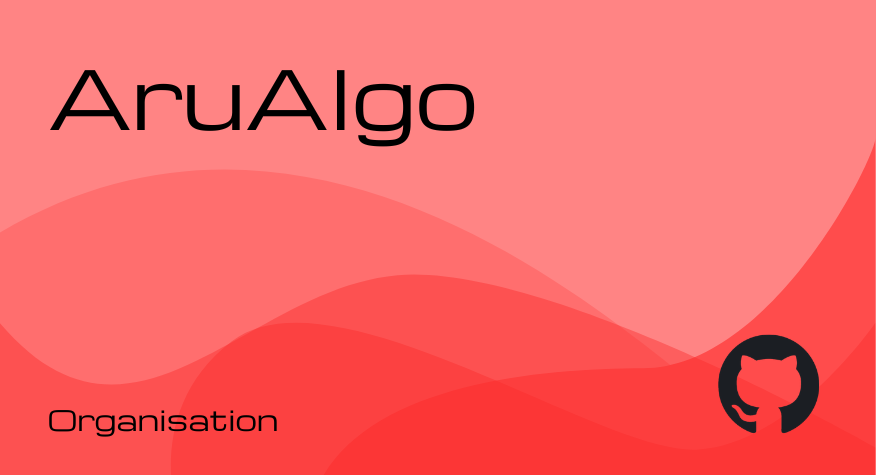
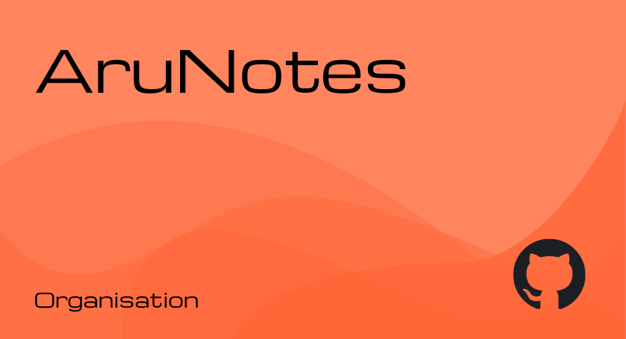
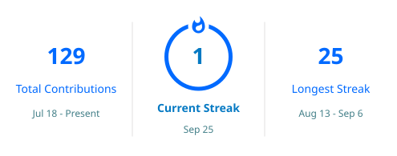
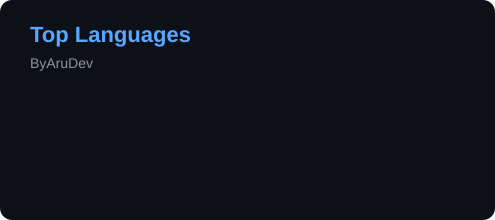
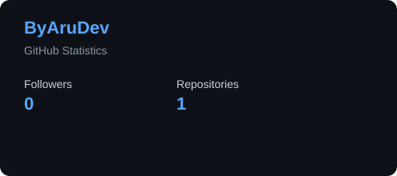

 
 

 

 

</a>

> [!CAUTION]
> Some sections, projects, and links on this profile may be incomplete or not work yet.
> I'm still finishing things up — in other words, **I'm just lazy lol** 💀. Not every link has been fully set up yet. 🚧

---

## 🚀 A little about me...

I am a **Grade 12 student and aspiring Full-Stack & Software Developer** passionate about building meaningful digital experiences.

I focus on:

* 💡 Turning ideas into real products
* 🎨 Blending functionality with design
* 🚀 Building full-stack & creative web projects

Tech I work with:
**JavaScript, Python, Node.js, Express, Flask, FastAPI, MongoDB, GSAP, Three.js**

---

## 🏢 My Organizations (Clickable)

<table>
<tr>
<td></td>
<td></td>
</tr>
<tr>
<td></td>
<td></td>
</tr>
</table>

---

## 🛠️ Tech Stack

| Category      | Stack                                                                                     |
| ------------- | ----------------------------------------------------------------------------------------- |
| **Languages** |                           |
| **Frontend**  |             |
| **Backend**   |                  |
| **Database**  |                        |
| **Tools**     |  |
| **Security** |  |

---

## 🏆 Certifications & Awards

  
<b>📜 Certifications</b>

- 🏅 Add your certification here
- 🏅 Add your certification here
- 🏅 Add your certification here

  
<b>🏆 Awards</b>

- 🥇 Add your award here
- 🥈 Add your award here
- 🏅 Add your award here

---

## 📊 Statistics

  

  

---

## 🎲 Random Stuff I Did

> ### 💭 What have I been doing?
> Random things. Random projects. Random ideas.
> Sometimes productive. Sometimes questionable. Usually both.

<!-- RANDOM_STUFF_START -->

> 🧪 **Today's random activity:** Experimented with a new UI animation.

<!-- RANDOM_STUFF_END -->

`⚡ RANDOMLY GENERATED` &nbsp; `🔄 AUTO-UPDATED` 

